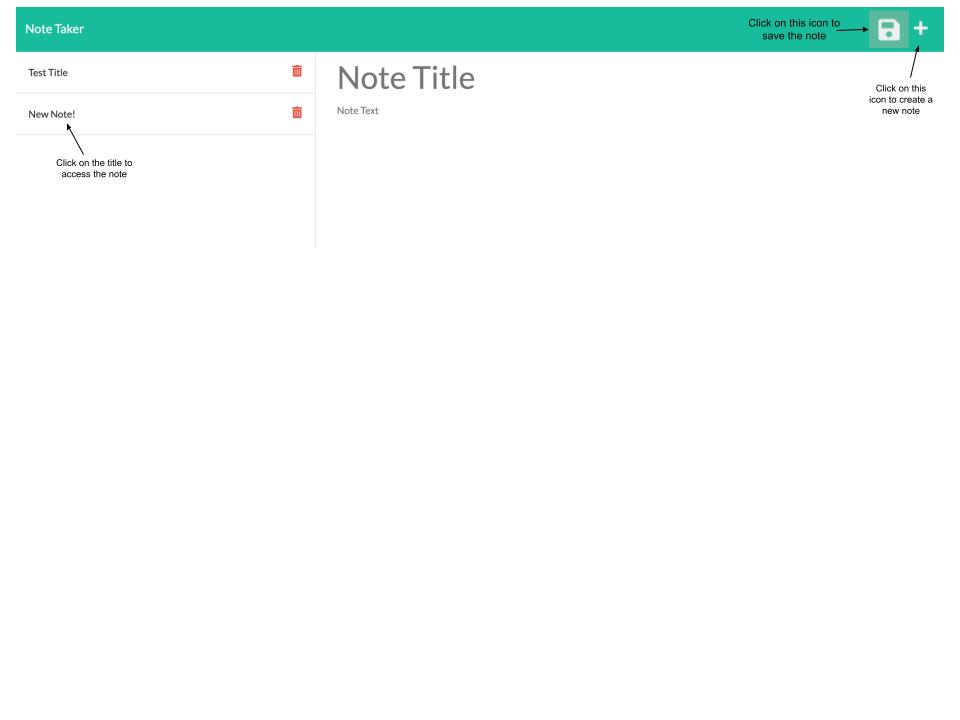

# Express Note Taker

## Description
This application can be used to take and save notes to be accessed later on..

## Table of Contents
  1. [Installation Instructions](#installation)
  2. [Usage Information](#usage)
  3. [Contribution Guidelines](#contribution)
  4. [Testing](#testing)
  5. [License information](#Licensing)
  6. [Questions](#questions)
  ## Installation
  This application requires no installation.
  ## Usage
  This application allows users to create and save notes. Each note has a title and body to be filled in by the user. To create a note, click the '+' icon in the upper right corner. To save a note, click the file icon in the upper right corner. Note: the note must contain a title and body text in order to be saved. In order to access a previously made note, simply click on its title in the column on the left. Note: the delete button does not yet have functionality.

  ## Contribution
  There were no other contributions to this application.
  ## Testing
  This application has no testing.
  ## Licensing
  This application has no license.
  ## Questions
  If you have any further questions, 
   - You can email me at: kami.gillespie@gmail.com
   - You can find my GitHub at: [kamarygillespie4](https://github.com/kamarygillespie4)
